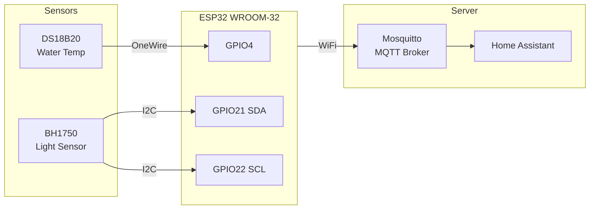
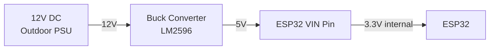
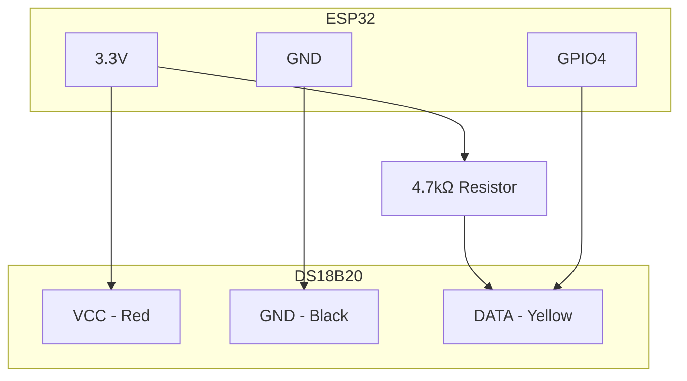
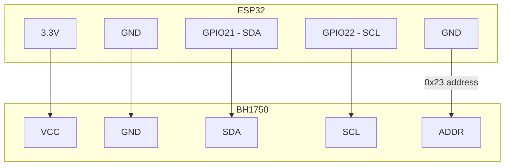

# ESP32 Pool Monitor

An ESP32-based outdoor pool monitor that measures water temperature and light levels, sending data via MQTT to Home Assistant.

## System Architecture



## Wiring

### Power Supply



### DS18B20 Temperature Sensor



### BH1750 Light Sensor



## MQTT Topics

| Topic | Description | Unit |
|-------|-------------|------|
| `pool/temperature` | Water temperature (avg of last 10 readings) | °C |
| `pool/light` | Light level (avg of last 10 readings) | lx |

## Project Structure

```
src/
├── main.cpp            # Main setup and loop
├── config.h            # WiFi & MQTT credentials (not in git)
├── temperature.h/.cpp  # DS18B20 sensor
├── light.h/.cpp        # BH1750 sensor
├── mqtt.h/.cpp         # WiFi & MQTT connection
└── movingaverage.h     # Moving average helper
```

## Configuration

Copy `src/config.h.example` to `src/config.h` and fill in your credentials:

```cpp
#define WIFI_SSID     "your-wifi-ssid"
#define WIFI_PASSWORD "your-wifi-password"

#define MQTT_HOST     "your-mqtt-host"
#define MQTT_PORT     1883
#define MQTT_USER     "your-mqtt-user"
#define MQTT_PASSWORD "your-mqtt-password"

#define MQTT_TOPIC_TEMPERATURE  "pool/temperature"
#define MQTT_TOPIC_LIGHT        "pool/light"
```

## Home Assistant

Add to `configuration.yaml`:

```yaml
mqtt:
  sensor:
    - name: "Pool Temperatur"
      state_topic: "pool/temperature"
      unit_of_measurement: "°C"
      device_class: temperature
      unique_id: "pool_temperature"
      device:
        identifiers: ["esp32_pool"]
        name: "ESP32 Pool Sensor"
        model: "ESP32-WROOM-32"
        manufacturer: "AZ-Delivery"

    - name: "Pool Helligkeit"
      state_topic: "pool/light"
      unit_of_measurement: "lx"
      device_class: illuminance
      unique_id: "pool_light"
      device:
        identifiers: ["esp32_pool"]
        name: "ESP32 Pool Sensor"
        model: "ESP32-WROOM-32"
        manufacturer: "AZ-Delivery"
```
